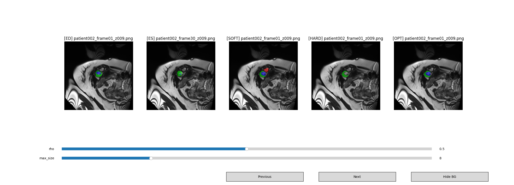

# Anchor-Guided SAM3 Cardiac Segmentation Refinement on ACDC

This repository provides a complete pipeline for generating, refining, evaluating, and visualizing SAM3-based cardiac segmentation masks on the ACDC dataset.



**Figure 1.** Visual comparison of cardiac segmentation masks. **SOFT** and **HARD** denote the direct SAM3 outputs obtained using low and high confidence thresholds, respectively. The proposed test-time refinement method (**OPT**) refines these initial predictions, correcting threshold-induced errors and producing more anatomically consistent segmentations.

## Pipeline Overview

1. Install environment
2. Download ACDC dataset
3. Preprocess NIfTI volumes into PNG frames
4. Generate SAM3 pseudo masks
5. Post-process predictions
6. Fast evaluation of refined masks
7. Interactive visualization

---

## 1. Install Environment

Create a Conda environment and install dependencies:

```bash
bash build_env.sh
```

This script:

* Creates a Conda environment named `sam3`
* Installs PyTorch with CUDA support
* Installs Hugging Face dependencies

```bash
conda activate sam3
```

---

## 2. Download ACDC Dataset

Download the ACDC dataset from the official challenge website:

https://www.creatis.insa-lyon.fr/Challenge/acdc/

Expected directory structure:

```text
ACDC/
├── training/
│   ├── patient001/
│   ├── patient002/
│   └── ...
└── testing/
    ├── patient101/
    ├── patient102/
    └── ...
```

---

## 3. Preprocess Videos into Individual Frames

Convert ACDC NIfTI volumes into flattened PNG slices and generate initial SAM3 pseudo masks.

### Training Set

```bash
python presets.py \
    --raw_dir /path/to/ACDC/training \
    --out_dir acdc_train \
    --image_size 224
```

### Testing Set

```bash
python presets.py \
    --raw_dir /path/to/ACDC/testing \
    --out_dir acdc_test \
    --image_size 224
```

Output structure:

```text
acdc_train/
├── images/
├── masks/
├── pseudo_soft_masks/
├── pseudo_hard_masks/
└── classification_images.csv
```

---

## 4. Generate SAM3 Output Masks

Pseudo masks are automatically generated during preprocessing.

Two versions are produced:

```text
pseudo_soft_masks/
pseudo_hard_masks/
```

The model uses three text prompts:

* right ventricle
* myocardium
* left ventricle

and stores the resulting SAM3 segmentation logits as PNG masks.

---

## 5. Postprocess Predictions

Refine pseudo masks using temporal consistency and anatomy-aware denoising.

### Training Set

```bash
python postset.py \
    --root-dir ./acdc_train \
    --rho 0.5 \
    --max-size 8
```

### Testing Set

```bash
python postset.py \
    --root-dir ./acdc_test \
    --rho 0.5 \
    --max-size 8
```

Output:

```text
pseudo_opt_masks/
└── rho_0.50/
    └── max_size_8/
```

Parameters:

| Argument   | Description                       |
| ---------- | --------------------------------- |
| `rho`      | Temporal propagation strength     |
| `max_size` | Remove small connected components |

---

## 6. Fast Evaluation

Evaluate pseudo masks against available annotations.

### Baseline

```bash
python unit_eval.py \
    --root-dir ./acdc_train \
    --mode baseline \
    --thres 0.15
```

### Self-Derived Prompts

```bash
python unit_eval.py \
    --root-dir ./acdc_train \
    --mode self_derived_prompts
```

### Annotation-Derived Prompts

```bash
python unit_eval.py \
    --root-dir ./acdc_train \
    --mode annotation_derived_prompts
```

Metrics reported:

* Foreground Dice
* RV Dice
* MYO Dice
* LV Dice

Results are appended to:

```text
dice_scores.txt
```

### Quick Evaluation Script

```bash
bash unit_eval.sh
```

---

## 7. Interactive Visualization

Launch the interactive viewer:

```bash
python unit_test.py
```

Features:

* Browse temporal frames
* Compare:

  * Ground Truth
  * SAM3 Soft Masks
  * SAM3 Hard Masks
  * Refined Masks
* Adjust refinement parameters:

  * `rho`
  * `max_size`
* Toggle image background
* Save visualization tapes

---

## Directory Layout

```text
project/
├── build_env.sh
├── presets.py
├── postset.py
├── denoise.py
├── unit_eval.py
├── unit_test.py
│
├── acdc_train/
│   ├── images/
│   ├── masks/
│   ├── pseudo_soft_masks/
│   ├── pseudo_hard_masks/
│   └── pseudo_opt_masks/
│
└── acdc_test/
    ├── images/
    ├── pseudo_soft_masks/
    ├── pseudo_hard_masks/
    └── pseudo_opt_masks/
```

---

## Citation

If you use this repository, please cite:

* ACDC Challenge Dataset
* Meta SAM3
* Any associated publication accompanying this repository
